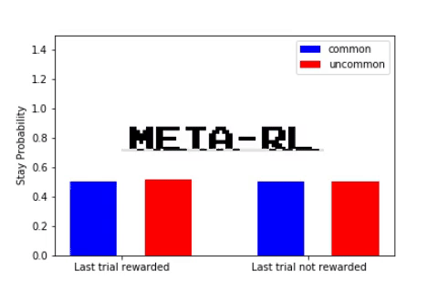
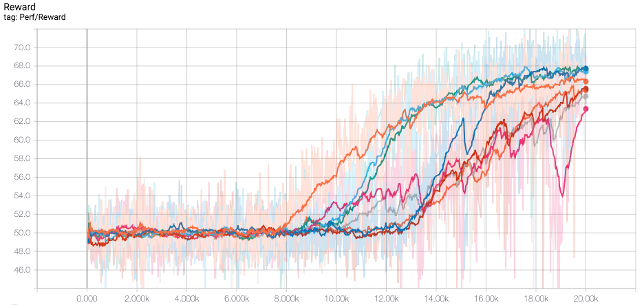

<p align="center">
  
</p>

[](https://floydhub.com/run?template=https://github.com/mtrazzi/two-step-task)

⚠ **Note**: This is the code for my article [Meta-Reinforcement Learning](https://blog.floydhub.com/author/michaeltrazzi/) on FloydHub. This repository is for the two-step task. For the Harlow task see [this repository](https://github.com/mtrazzi/harlow) instead.⚠

We reproduced the simulations regarding the two-step task as described in the two papers:
- [Learning to Reinforcement Learn, Wang et al., 2016](https://arxiv.org/pdf/1611.05763v1.pdf)
- [Prefrontal cortex as a meta-reinforcement learning system, Wang et al., 2018](https://www.biorxiv.org/content/biorxiv/early/2018/04/13/295964.full.pdf)

For a short explanation of the two-step task, see [`two-step-task.ipynb`](https://github.com/mtrazzi/two-step-task/blob/master/two-step-task.ipynb).

## Main Result

We reproduced the plot from [Prefrontal cortex as a meta-reinforcement learning system](https://www.biorxiv.org/content/biorxiv/early/2018/04/13/295964.full.pdf) (Simulation 4, Figure b), on the right). We launched n=8 trainings using different seeds, but with the same hyperparameters as the paper, to compare to the results obtained by Wang et al.

For each seed, the training consisted of 20k episodes of 100 trials (instead of 10k episodes of 100 trials in the paper). The reason for our number of episodes choice is that, in our case, the learning seemed to converge after around ~20k episodes for most seeds.



After training, we tested the 8 different models for 300 further episodes (like in the paper), with the weights of the LSTM being fixed.

Here is the side by side comparison of our results (on the left) with the results from the paper (on the right):


## Installation

Clone this repository and install the other dependencies with `pip3`:

```
git clone https://github.com/mtrazzi/two-step-task.git
cd two-step-task
pip3 install -U -r requirements.txt
```

## Notebooks

The results of our attempt at reproducing the results of "Learning to Reinforcement Learn" as described in the arxiv pre-print are included in the notebook `arxiv.ipynb`.

For the implementation of the two-step task as descibed in "Prefrontal cortex as a meta-reinforcement learning system", we have included two different implementation:
- The first one, in `biorxiv-first-try.ipynb` is an interpretation of the experiments where the LSTM is fed actions and rewards both from first and second stage. We saw that the convergence was much slower than in the paper, so we changed our approach.
- The second implementation, in `biorxiv-final.ipynb`, feeds only actions from first stage and rewards from second stage in the LSTM. Furthermore, the simulation was launched for 8 different seeds, to compare with the plot with eight seeds from the paper. We find that our results closely matched the results from the paper.

## Directory structure

The notebooks are at the root of the repository.

Our trained models can be find in the directory `results`. In particular, our two trainings (with respectively 137k and 40k episodes) related to the arxiv pre-print "Learning to reinforcement learn" can be found in `results/arxiv`, and our two implementations for the biorxiv pre-print "Prefrontal cortex as a meta-reinforcement learning system" can be found in `results/biorxiv`.

``` bash
Meta-RL
├── LICENSE
├── README.md
├── arxiv.ipynb
├── biorxiv-final.ipynb
├── biorxiv-first-try.ipynb
├── helper.py
├── requirements.txt
└── results
    ├── arxiv
    │   ├── arxiv_137k
    │   └── arxiv_40k
    └── biorxiv
        ├── final
        └── first-try
```

## Plots 

The plots were generated with tensorboard.

For instance, to plot the reward for the eight simulations (as mentioned in "Main Results") do:


``` bash
tensorboard --logdir=results/biorxiv/final
```

## Models

For each sub-directory (i.e. `arxiv/arxiv_137k`, `arxiv/arxiv_40k`, `biorxiv/final` and `biorxiv/first-try`) we included the trained models.

- For `arxiv/arxiv_137k`, `arxiv/arxiv_40k` and `biorxiv/first-try`, the models can be found at `train/model_meta_context/model-[number of training episodes]/`.
- For `biorxiv/final`, it's at `model_[seed number]/model-20000/`

To test the trained model, the `load_model`variable must be set to `True`and the `load_model_path` must be set to one of the path mentionned above (e.g. `load_model_path=results/biorxiv/final/model_[seed number]/model-20000/`).


## Authors

[Michaël Trazzi](https://github.com/mtrazzi) and [Yasmine Hamdani](https://github.com/Yasmine-H), under the supervision of [Olivier Sigaud](https://github.com/osigaud).

## Credits

This work uses [awjuliani's Meta-RL implementation](https://github.com/awjuliani/Meta-RL) allowing only one thread/worker (so it was equivalent to a single-threaded A2C LSTM). We completely changed the code for the bandits to adapt to the two-step task, while keeping the same API.

All the code for the plots/gifs is ours.
